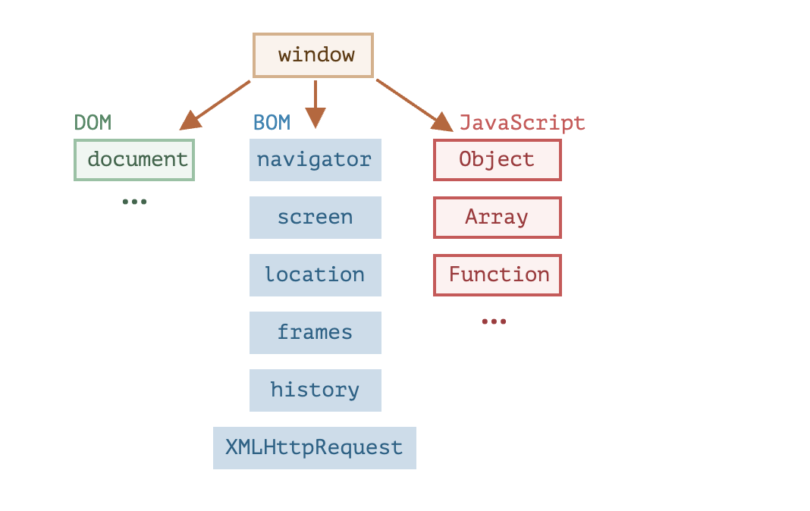
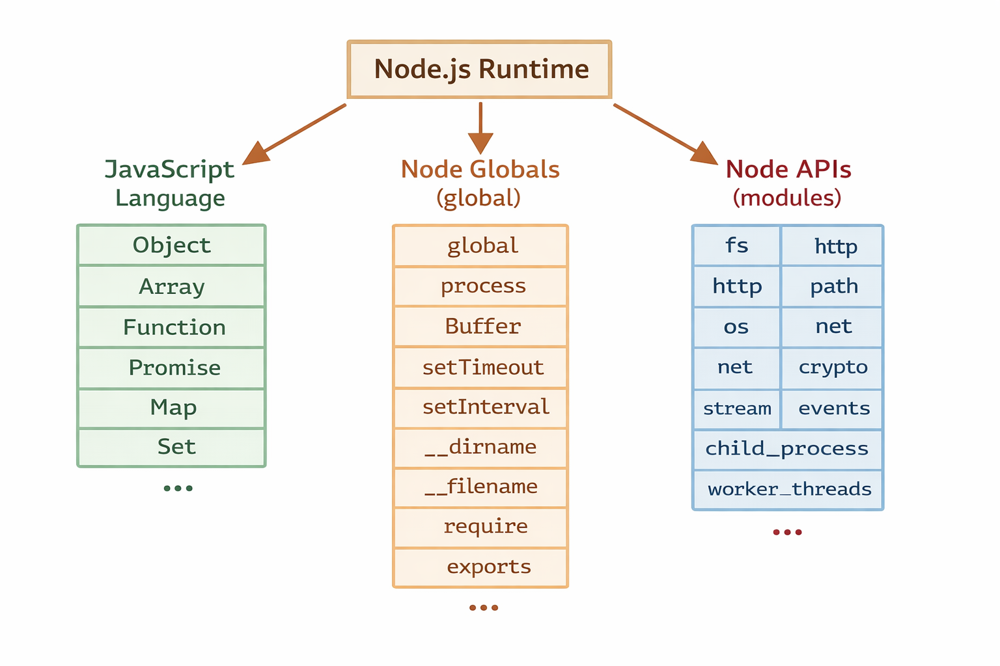
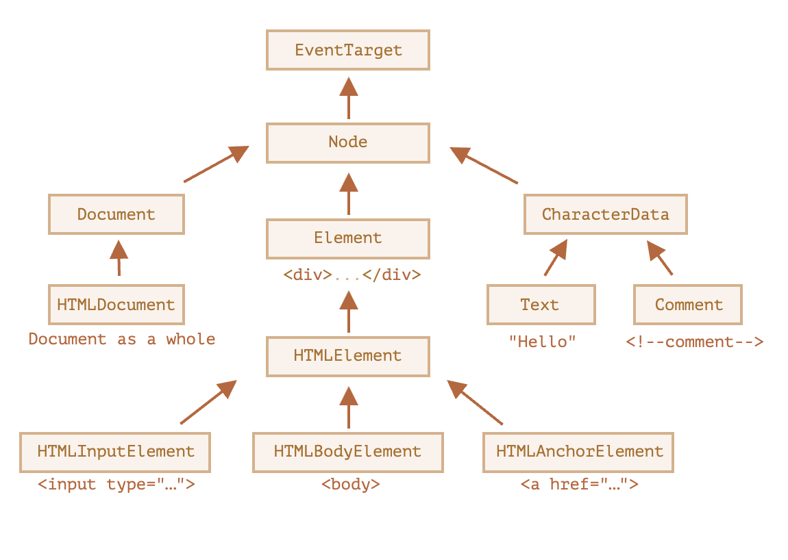

This is the playground for JavaScript

# Introduction

The JavaScript language was initially created for web browsers. Since then, it has evolved into a language with many uses and platforms.

A platform may be a browser, or a web-server or another host, or even a "smart" coffee machine if it can run JavaScript. Each of these provides platform-specific functionality. The JavaScript specification calls that a host environment.

A host environment provides its own objects and functions in addition to the language core. Web browsers give a means to control web pages. Node.js provides server-side features, and so on.

Here's a bird's-eye view of what we have when JavaScript runs in a web browser:

#### Browser:

#### Node:

# Simple notes 
- scripts inside html docs can only access the document lines above so. if a script is inside <head> it cannot read <body>

## DOM Node classes

READ more at https://javascript.info/basic-dom-node-properties
