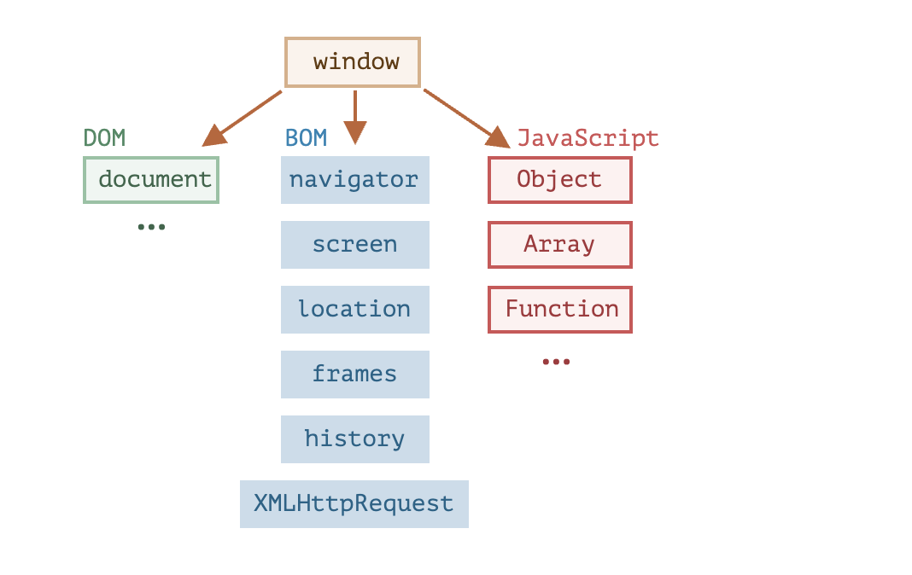
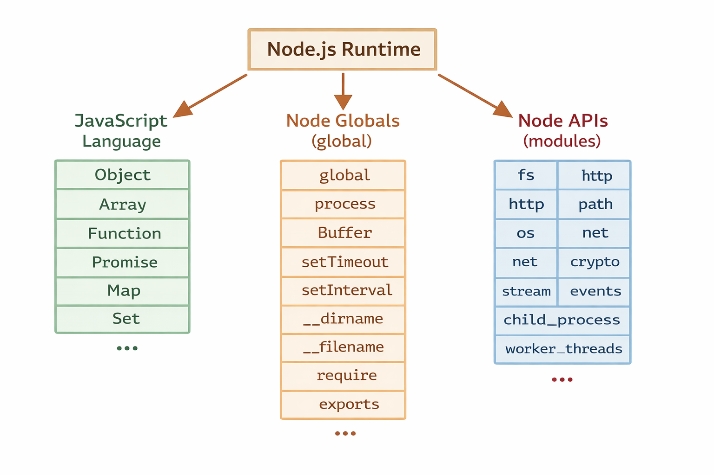
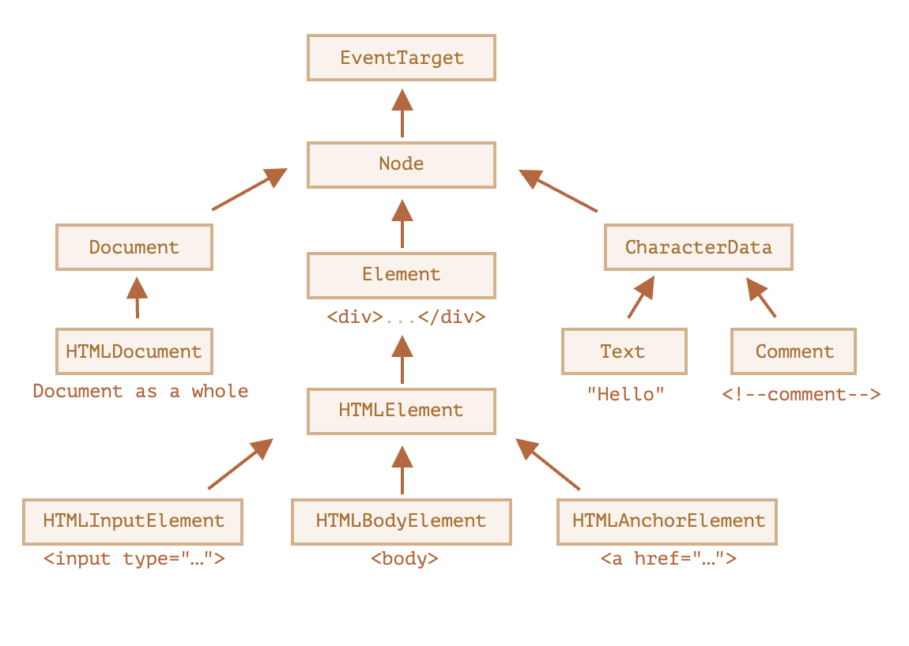

This mono repository is the playground learning-ground for JavaScript.
Most of the learning materials are written as code examples. But Some notes or useful images are here in README as well.

# Introduction

The JavaScript language was initially created for web browsers. Since then, it has evolved into a language with many uses and platforms.

A platform may be a browser, or a web-server or another host, or even a "smart" coffee machine if it can run JavaScript. Each of these provides platform-specific functionality. The JavaScript specification calls that a host environment.

A host environment provides its own objects and functions in addition to the language core. Web browsers give a means to control web pages. Node.js provides server-side features, and so on.

Here's a bird's-eye view of what we have when JavaScript runs in a web browser:

#### Browser:



#### Node:



# Simple notes

- scripts inside HTML docs can only access the document lines above so. if a script is inside <head> it cannot read <body>
- JavaScript introduced ES Modules with import and export as the modern, standardized module system, while Node originally used its own older system called CommonJS, which loads modules using require() and module.exports.

## DOM Node classes


READ more at https://javascript.info/basic-dom-node-properties

## NPM Commands:

| Dart / Flutter                   | npm equivalent                                |
| -------------------------------- | --------------------------------------------- |
| `dart pub add pkg`               | `npm install pkg`                             |
| `dart pub add --dev pkg`         | `npm install -D pkg`                          |
| `dart pub get`                   | `npm install`                                 |
| `dart pub install`               | `npm install`                                 |
| `flutter clean`                  | `rm -rf node_modules && rm package-lock.json` |
| `dart pub global activate pkg`   | `npm install -g pkg`                          |
| `dart pub global deactivate pkg` | `npm uninstall -g pkg`                        |

## JavaScript Testing

#### components equivalent in Javascript (with mocha)

This is a setup if you're building a JavaScript library. For testing
React components, you should use `jest` library instead of `mocha`

- group → describe
- test → it
- setUp → beforeEach
- tearDown → afterEach
- setUpAll → before
- tearDownAll → after

#### Test Structure:

```
my-lib/
  src/
    math.js
  test/
    math.test.js
  package.json
```

#### Basic requirements in package.json

```json
{
  "name": "my-lib",
  "type": "module",
  "scripts": {
    "test": "mocha",
    "test:watch": "mocha --watch"
  },
  "devDependencies": {
    "mocha": "^10.0.0",
    "chai": "^4.0.0"
  }
}
```

Then run `npm test` to run the `test` script defined in `package.json`

# React

### Simple notes:

- Use vite for creating new projects
- Similar to Flutter `main.jsx` is the entrypoint for our application.
- `App.jsx` is usually where the root component is defined.
- The main style file for the whole app is in `src/index.css` other than that each component has its own css file by convention eg: `Btn.jsx` has a `Btn.css`. That being said, there is no limitation on how many css files can be imported in a component file.
- Whatever put in `/public` will be directly available after build.
- Whatever put in `/src/assets` will be processed by vite base on the set configuration during build.

### Vite Project

Vite is a frontend build tool.

- To create a new react/vue/angular/etc project run `npm create vite@latest`
- choose React and then "Javascript" or "Typescript"

##### Vite config:

`vite.config.js` controls how the app runs and builds.

- plugins: extend Vite (React, PWA, SVG, etc.)
- server: dev server settings (port, proxy, HTTPS)
- build: production output (bundling, chunks, sourcemaps)
- resolve: path aliases for cleaner imports
- css / define / base: styling, globals, deploy path

##### What is Module Resolution?

Module resolution = how Vite finds files when you use `import`.

- Relative imports: ./ and ../ paths from current file
- Node modules: packages from node_modules (e.g. 'react')
- Aliases: custom path shortcuts (e.g. '@' → '/src')
  Vite controls these rules via the `resolve` option.

### Module import/export rules

In Javascript any file that has import or export directive is called module.

In Javascript there are named exports and default exports

- Named export: it has a fixed name when you import it. You must use that name, unless you explicitly rename it with as.
- Default export: you import it and choose the name

❗ Key rules:

- Only ONE default export per file
- Named exports can be MANY
- Default = no name → you choose it at import
- Named = fixed name → must match (unless using "as")

⚡ One-liner:
default = "bring me the main thing (name it yourself)"
named = "bring me this exact thing by its name"

🧠 ES Modules Cheat Sheet (short & sharp)
| TYPE | EXPORT SYNTAX | IMPORT SYNTAX | CAN RENAME? |
| -------------- | ---------------------------- | ------------------------------- | ----------------------- |
| Default export | `export default Something` | `import AnyName from './file'` | ✅ Yes (anything) |
| | `export default function() {}` | `import AnyName2 from './file'` | |
| Named export | `export const A = 1` | `import { A } from './file'` | ❌ No (must match) |
| | `export function B() {}` | `import { B } from './file'` | |
| Rename named | `export const A = 1` | `import { A as X } from './file'` | ✅ Yes (with "as") |
| Mixed | `export default X` | `import X, { A } from './file'` | |
| | `export const A = 1` | | |
| Import all | `export const A = 1` | `import * as All from './file'` | Access via All.A, All.B |
| | `export const B = 2` | | |

### Prettier + ESLint setup + WebStorm config

ESLint for code quality and Prettier for code formatting.
like dart analyze and dart format
There is also a tool called `biome` which is the equivalent of `Ruff` in python and It handles both lint+format responsibility

After setup. you must get lints from eslint in your code. and format from prettier on file save.

Also you can run format and lint manually

##### 1️⃣ Install

`npm i -D prettier eslint eslint-config-prettier`

Add following scripts to `package.json`. These commands allows you to run lint and format manually.

```
"lint": "eslint .",
"format": "prettier --write ."
```

##### 2️⃣ Add Prettier config

Create `.prettierrc` in project root:

```json
{
  "semi": false,
  "singleQuote": true,
  "trailingComma": "es5",
  "printWidth": 80
}
```

Create `.prettierignore`:

```
node_modules
dist
build
coverage
```

##### 3️⃣ Configure ESLint

Create or edit `.eslintrc`:

```
{
  "extends": [
    "eslint:recommended",
    "plugin:react/recommended",
    "prettier"
  ]
}
```

`eslint-config-prettier` disables ESLint rules that conflict with Prettier.
It does NOT replace Prettier.

##### 4️⃣ Important clarification

- You STILL use Prettier when using `eslint-config-prettier`.
- `eslint-config-prettier` only prevents rule conflicts.
- `.prettierrc` is still required for formatting rules.

##### 5️⃣ Enable in WebStorm

**Prettier**
Settings → Languages & Frameworks → JavaScript → Prettier

- Set package to `node_modules/prettier`
- Enable "On save"

**ESLint**
Settings → Languages & Frameworks → JavaScript → Code Quality → Eslint

- Set package to `node_modules/eslint`
- Enable "On eslint --fix on save"

> NOTE: By default eslint does not fix unused imports when eslint --fix is ran. It removes unused vars and other things though.

**Enable optimize imports via IDE:**
Settings → Tools → Action On Save → (& enable) Optimize Imports

##### 6️⃣ Enable in VS Code (format on save / auto save)

**Extensions**

- **Prettier - Code formatter** (`esbenp.prettier-vscode`)
- **ESLint** (`dbaeumer.vscode-eslint`)

**Settings**

Command Palette → **Preferences: Open User Settings (JSON)** (or add `.vscode/settings.json` in the project).

Use Prettier when the file is saved, and run ESLint fixes on save:

```json
{
  "editor.formatOnSave": true,
  "editor.defaultFormatter": "esbenp.prettier-vscode",
  "editor.codeActionsOnSave": {
    "source.fixAll.eslint": "always"
  }
}
```

If you use **File → Auto Save** (or `files.autoSave` such as `afterDelay`), `"always"` ensures ESLint fixes run whenever the file is saved automatically, not only on a manual save (`Cmd+S` / `Ctrl+S`). If you rely only on manual save, `"explicit"` is enough for ESLint fixes.

Optional: enable auto save in settings, for example:

```json
"files.autoSave": "afterDelay",
"files.autoSaveDelay": 1000
```

## Common React Hooks

React Hooks let you use state, lifecycle behavior, and other React features inside functional components.

| Pattern                  | Hooks         |
| ------------------------ | ------------- |
| Local component state    | `useState`    |
| API calls / side effects | `useEffect`   |
| Prevent child re-renders | `useCallback` |
| Derived state            | `useMemo`     |
| DOM access               | `useRef`      |
| Global state             | `useContext`  |
| Complex state management | `useReducer`  |

List of all built-in react hooks https://react.dev/reference/react/hooks

#### Functional State Update (React)

Use:

```js
setCount((prev) => prev + 1);
```

instead of:

```js
setCount(count + 1);
```

**Why:** React may **batch updates**, so `count` can be **stale**.

Example:

```js
setCount(count + 1);
setCount(count + 1);
```

Result: `+1`

Correct:

```js
setCount((prev) => prev + 1);
setCount((prev) => prev + 1);
```

Result: `+2`

### React `useEffect`

`useEffect` is a React Hook used to run **side effects** after a component renders.

A **side effect** means code that affects something outside the normal UI render, such as:

```tsx
document.title = "Home";
fetch("/api/products");
setInterval(...);
window.addEventListener(...);
localStorage.setItem(...);
```

React is just a library that gives us component. In react by default component are considered to be pure. take in props and render the component. But outside this flow there are side effects that needs to be synchronized with react, its components and its components lifecycles. One synchronization example is run a code like api call right after the first render. Another is run an api call (side effect) every time a reactive value like a prop or state changes.

React is commonly called a front-end framework, but more precisely, it is a JavaScript library for building user interfaces.

The core problem React solves is the **UI composition and rendering problem**: how to define reusable pieces of interface, organize them into a component tree, and render that tree to the screen. React solves this through its component model. A component receives props as input and returns UI as output. Ideally, components are pure: given the same props, they produce the same result. When props or state change, React re-renders the affected parts of the component tree.

But building a real application requires more than rendering UI. Applications also need to communicate with things outside the component tree: APIs, browser storage, timers, subscriptions, events, analytics, and other external systems. This creates another problem: **the side-effect synchronization problem**. In other words, how do we run code after a component renders? How do we react when a prop or state value changes? How do we keep React components synchronized with external systems?

React’s solution to this problem is Hooks, and the Hook specifically designed for this kind of work is `useEffect`. In React terminology, these external operations are called **side effects**, which is why the Hook is named `useEffect`. A name like `useSideEffect` might have been more explicit, but `useEffect` means: run this effect after rendering, usually to synchronize the component with something outside React.

#### Basic Syntax

```tsx
useEffect(() => {
  // runs after render

  return () => {
    // optional cleanup
  };
}, [dependencies]);
```

#### Dependency Array

```tsx
useEffect(() => {
  // runs after every render
});
```

```tsx
useEffect(() => {
  // runs once when component mounts
}, []);
```

```tsx
useEffect(() => {
  // runs when count changes
}, [count]);
```

#### Example: Timer

```tsx
import { useEffect, useState } from 'react';

function Timer() {
  const [seconds, setSeconds] = useState(0);

  useEffect(() => {
    const intervalId = setInterval(() => {
      setSeconds((prev) => prev + 1);
    }, 1000);

    return () => {
      clearInterval(intervalId);
    };
  }, []);

  return <p>Seconds: {seconds}</p>;
}
```

`useState(0)` creates the `seconds` state.

`useEffect(..., [])` creates the interval once when the component mounts.

`setSeconds((prev) => prev + 1)` safely updates state using the latest previous value.

The returned function is cleanup. It stops the interval when the component unmounts.

#### Example: Document Title

```tsx
useEffect(() => {
  document.title = `Cart: ${cartItems.length}`;
}, [cartItems.length]);
```

`cartItems` could be state, props, context, or store data. It must be considered a reactive value. In React, reactive values include props, state, and variables/functions declared inside the component. If an effect reads a reactive value, React’s dependency rules say it should be included in the dependency list so the effect stays synchronized

`[cartItems.length]` is valid. The effect runs only when the cart count changes.

Use:

```tsx
[cartItems.length];
```

when only the count matters.

Use:

```tsx
[cartItems];
```

when the actual items matter.

#### How React Connects Hooks to Components

When React renders a component, it calls the component function.

Hooks called during that render are attached to that component instance.

React tracks hooks by **call order**, not by variable name.

```tsx
function Component() {
  const [count, setCount] = useState(0); // hook #1
  useEffect(() => {}, []); // hook #2

  return <p>{count}</p>;
}
```

Because of this, hooks must always be called in the same order.

#### Custom Hooks

If a function uses a hook, name it with `use`.

```tsx
function useDocumentTitle(title: string) {
  useEffect(() => {
    document.title = title;
  }, [title]);
}

function CartPage({ cartItems }) {
  useDocumentTitle(`Cart: ${cartItems.length}`);

  return <p>Cart items: {cartItems.length}</p>;
}
```

A custom hook shares logic, not shared state. Each component gets its own hook behavior.

#### Event Handler vs `useEffect`

Use an event handler for user actions:

```tsx
function handleClick() {
  console.log('User clicked');
}
```

Use `useEffect` for work caused by rendering or state/prop changes:

```tsx
useEffect(() => {
  document.title = `Count: ${count}`;
}, [count]);
```

#### Don’ts

Do not use `useEffect` to calculate simple render values.

```tsx
const fullName = firstName + ' ' + lastName;
```

Do not call hooks inside:

```
if statements
loops
nested functions inside components
event handlers
normal utility functions which names not start with `use`
```

Bad:

```tsx
if (enabled) {
  useEffect(() => {}, []);
}
```

Good:

```tsx
function useSomething() {
  useEffect(() => {}, []);
}
```

#### Core Rule

`useEffect` runs after render and is mainly used to synchronize a component with something outside React.

## Add routing to a React app with React Router (react-router-dom)

### 1. Install dependencies

```bash
npm install react-router-dom react-dom
```

### 2. Wrap your app with `BrowserRouter`

Open your entry file (e.g. `main.jsx` or `main.tsx`):

```jsx
import React from 'react';
import ReactDOM from 'react-dom/client';
import { BrowserRouter } from 'react-router-dom';
import App from './App';

ReactDOM.createRoot(document.getElementById('root')).render(
  <React.StrictMode>
    <BrowserRouter>
      <App />
    </BrowserRouter>
  </React.StrictMode>,
);
```

### 3. Define your routes in `App.jsx`

```jsx
import { Routes, Route } from 'react-router-dom';

function Home() {
  return <h1>Home</h1>;
}

function About() {
  return <h1>About</h1>;
}

function NotFound() {
  return <h1>404</h1>;
}

export default function App() {
  return (
    <Routes>
      <Route path="/" element={<Home />} />
      <Route path="/about" element={<About />} />
      <Route path="*" element={<NotFound />} />
    </Routes>
  );
}
```

### 4. Add navigation links

```jsx
import { Link } from 'react-router-dom';

export default function Navbar() {
  return (
    <nav>
      <Link to="/">Home</Link> | <Link to="/about">About</Link>
    </nav>
  );
}
```

### 5. Use the navbar

```jsx
import { Routes, Route } from 'react-router-dom';
import Navbar from './Navbar';

function Home() {
  return <h1>Home</h1>;
}

function About() {
  return <h1>About</h1>;
}

export default function App() {
  return (
    <>
      <Navbar />

      <Routes>
        <Route path="/" element={<Home />} />
        <Route path="/about" element={<About />} />
      </Routes>
    </>
  );
}
```

### How to navigate

```jsx
<button onClick={() => navigate(ROUTES.DASHBOARD_SETTINGS)}>
  Go to settings
</button>

<NavLink to={ROUTES.DASHBOARD_PROFILE}>Profile</Link>
```

## React Entry point

#### index.html

Contains:

```html
<div id="root"></div>
<script type="module" src="/src/main.jsx"></script>
```

This loads `main.jsx` and provides the DOM node React mounts into.

#### What is `main.jsx`

```jsx
import { StrictMode } from 'react';
import { createRoot } from 'react-dom/client';
import { BrowserRouter } from 'react-router-dom';
import './index.css';
import App from './App.jsx';

createRoot(document.getElementById('root')).render(
  <StrictMode>
    <BrowserRouter>
      <App />
    </BrowserRouter>
  </StrictMode>,
);
```

Entry point of the app. It connects React to the DOM and starts rendering your UI.

- `createRoot(domNode)` creates a React root and lets React control that DOM element.
- `.render(<App />)` tells React what component tree to display inside the root.

#### What if `main.jsx` doesn't exist

React never mounts → app doesn’t run → blank page (unless another entry replaces it). In short `main.jsx` isn’t special by React itself, but by the setup (HTML + bundler) which uses it as the starting point.

## Add Tailwind

To Add tailwind to vite setup go to https://tailwindcss.com/docs/installation/using-vite

Then go to `index.css` file and write

```css
@import 'tailwindcss';
```

### 1. What Tailwind _is_ (Core Concept)

**Mental model (one-liner):**

> Tailwind = _utility-first CSS_ → you compose UI by stacking small single-purpose classes.

Instead of writing this:

```css
.card {
  display: flex;
  justify-content: center;
  align-items: center;
  padding: 16px;
  background: white;
}
```

You write this directly in HTML:

```html
<div class="flex justify-center items-center p-4 bg-white"></div>
```

#### Why this matters

- No context switching (CSS file ↔ JSX)
- No naming struggle (`card`, `container`, etc.)
- Faster iteration
- Highly consistent design system

### 2. How to Read Tailwind Classes

Tailwind classes follow a pattern:

```
[property]-[value]
```

Examples:

- `p-4` → padding: 1rem
- `text-lg` → font-size: large
- `bg-red-500` → background color

#### Variants (state + responsiveness)

```
[variant]:[class]
```

Examples:

`hover:bg-blue-500` → changes background to blue when the element is hovered
`md:flex → applies` flex layout only on medium screens and larger
`dark:text-white` → makes text white only when dark mode is active

### 3. 🔥 Core Categories (How to Structure It in Your Mind)

Think of Tailwind as **layers of UI control**:

#### 🧱 1. Layout (Structure of the page)

Controls positioning and layout behavior.

**Classes:**

- `block`, `inline`, `hidden`
- `flex`, `grid`
- `container`

#### 📦 2. Spacing (Breathing room)

Margins and padding.

**Classes:**

`p-4` → adds padding on all sides (1rem space inside the element)
`px-6` → adds horizontal padding left & right (1.5rem each side)
`py-2` → adds vertical padding top & bottom (0.5rem each side)
`m-4` → adds margin on all sides (1rem space outside the element)
`mt-2` → adds margin only to the top (0.5rem above the element)
`mx-auto` → sets left & right margins to auto (centers the element horizontally)

#### 📐 3. Sizing (Dimensions)

Width & height.

**Classes:**

`w-full` → sets width to 100% of the parent container  
`w-1/2` → sets width to 50% of the parent container  
`w-64` → sets width to a fixed size (16rem)  
`h-screen` → sets height to 100% of the viewport height  
`h-auto` → sets height based on the content (automatic height)

#### 🎯 4. Positioning

Where elements sit.

**Classes:**

`relative` → positions element relative to itself (enables offset positioning for children)  
`absolute` → positions element relative to nearest positioned parent (removed from normal flow)  
`fixed` → positions element relative to the viewport (stays fixed on screen)  
`top-0` → sets top position to 0 (aligns element to the top edge)  
`left-4` → offsets element 1rem from the left  
`z-10` → sets stacking order (places element above lower z-index elements)

#### 🎨 5. Backgrounds

Colors, gradients.

**Classes:**

`bg-red-500` → sets background color to a predefined red shade  
`bg-gradient-to-r` → applies a gradient background from left to right

#### 📝 6. Typography

Text styling.

**Classes:**

`text-lg` → sets font size to large  
`text-center` →
s text horizontally  
`font-bold` → makes text bold  
`leading-tight` → reduces line height for tighter text spacing

#### 🧩 7. Flexbox & Grid (Layout systems)

**Flex:**

`flex` → enables flexbox layout  
`justify-*` → controls horizontal alignment of children (start, center, between, etc.)  
`items-*` → controls vertical alignment of children (start, center, end, etc.)

**Grid:**

`grid` → enables CSS grid layout  
`grid-cols-3` → creates a grid with 3 equal columns  
`gap-4` → adds spacing (1rem) between grid or flex items

#### 🎭 8. Borders & Effects

**Classes:**

`border` → adds a default border around the element  
`border-gray-300` → sets border color to a light gray shade  
`rounded-lg` → applies large rounded corners  
`shadow-md` → adds a medium drop shadow

#### 🌗 9. States (Interaction)

**Classes:**

`hover:*` → applies styles when the element is hovered  
`focus:*` → applies styles when the element is focused  
`active:*` → applies styles when the element is actively pressed/clicked

#### 📱 10. Responsive Design

**Breakpoints:**

`sm:` → applies styles on small screens and up (≥640px)  
`md:` → applies styles on medium screens and up (≥768px)  
`lg:` → applies styles on large screens and up (≥1024px)  
`xl:` → applies styles on extra large screens and up (≥1280px)

Example:

```html
<div class="w-full md:w-1/2"></div>
```

### 4. Flexbox in Tailwind

#### Basic Flex

```html
<div class="flex"></div>
```

#### Direction

`flex-row` → arranges flex items horizontally (default direction)  
`flex-col` → arranges flex items vertically

#### Main Axis (horizontal by default)

`justify-start` → aligns items to the start of the main axis  
`justify-center` → centers items along the main axis  
`justify-between` → distributes items with space between them  
`justify-around` → distributes items with space around them

#### Cross Axis

`items-start` → aligns items to the start of the cross axis  
`items-center` → centers items along the cross axis  
`items-end` → aligns items to the end of the cross axis

#### Example

```html
<div class="flex justify-between items-center p-4">
  <span>Left</span>
  <span>Right</span>
</div>
```

### 5. Centering

#### 🔹 Center horizontally

```html
<div class="mx-auto w-40"></div>
```

#### 🔹 Center vertically + horizontally (flex)

```html
<div class="flex justify-center items-center h-screen">
  <div>Centered</div>
</div>
```

#### 🔹 Center with grid

```html
<div class="grid place-items-center h-screen">
  <div>Centered</div>
</div>
```

### 6. Common Patterns (Most Asked Things)

#### 🔹 Full screen container

```html
<div class="min-h-screen"></div>
```

#### 🔹 Card UI

```html
<div class="p-4 bg-white rounded-lg shadow-md"></div>
```

#### 🔹 Button

```html
<button class="px-4 py-2 bg-blue-500 text-white rounded hover:bg-blue-600">Click</button>
```

#### 🔹 Two columns

```html
<div class="grid grid-cols-2 gap-4"></div>
```

#### 🔹 Responsive layout

```html
<div class="grid grid-cols-1 md:grid-cols-2 lg:grid-cols-3"></div>
```

#### 🔹 Hide on mobile

```html
<div class="hidden md:block"></div>
```

### 7. How to Think in Tailwind

**Mental shift:**

> You are not writing styles → you are assembling behaviors.

Think like:

- “I want spacing” → `p-4`
- “I want alignment” → `flex items-center`
- “I want emphasis” → `font-bold text-lg`

### 8. Cheat Sheet (High-Value Classes)

| Category   | Class               | What it does           | Example Use Case |
| ---------- | ------------------- | ---------------------- | ---------------- |
| Layout     | `flex`              | Enables flexbox        | Layout rows      |
| Layout     | `grid`              | Enables grid           | Complex layouts  |
| Spacing    | `p-4`               | Padding                | Cards            |
| Spacing    | `m-4`               | Margin                 | Separation       |
| Sizing     | `w-full`            | Full width             | Containers       |
| Sizing     | `h-screen`          | Full viewport height   | Full page        |
| Flex       | `justify-center`    | Center horizontally    | Center items     |
| Flex       | `items-center`      | Center vertically      | Align items      |
| Grid       | `grid-cols-3`       | 3 columns              | Layout           |
| Grid       | `gap-4`             | Space between items    | Grids            |
| Text       | `text-lg`           | Large text             | Headings         |
| Text       | `font-bold`         | Bold text              | Emphasis         |
| Color      | `bg-blue-500`       | Background color       | Buttons          |
| Color      | `text-white`        | Text color             | Contrast         |
| Border     | `rounded-lg`        | Rounded corners        | Cards            |
| Border     | `border`            | Adds border            | Containers       |
| Shadow     | `shadow-md`         | Medium shadow          | Cards            |
| Position   | `absolute`          | Absolute positioning   | Overlays         |
| Position   | `z-10`              | Stack order            | Modals           |
| Responsive | `md:flex`           | Flex on medium screens | Adaptive UI      |
| State      | `hover:bg-blue-600` | Hover effect           | Buttons          |

### 9. Extra Power Features

#### Arbitrary values

`w-[300px]` → sets width to an exact custom value (300px)  
`h-[calc(100vh-80px)]` → dynamic height using CSS calc  
`bg-[#1e293b]` → custom hex background color  
`text-[22px]` → custom font size  
`p-[18px]` → custom padding  
`mt-[10%]` → margin-top using percentage  
`grid-cols-[200px_1fr_100px]` → custom grid column layout  
`shadow-[0_10px_30px_rgba(0,0,0,0.3)]` → fully custom shadow  
`rounded-[12px]` → custom border radius  
`translate-x-[37px]` → custom transform value  
`z-[999]` → custom z-index  
`bg-[linear-gradient(45deg,red,blue)]` → fully custom gradient

## Themes in React

React itself does not have a built-in visual theme system like Flutter’s ThemeData. React gives you component composition, props, state, and context. If you want a shared theme value, you usually use Context for that. React’s docs explicitly describe context as a way to pass information deep down, and theming is one of the standard examples. Components read it with useContext() when needed.

So in plain React, theming is more like:

> “Theme is just shared data. You decide where it lives.”

### But With Tailwind v4 in the picture

Tailwind v4 changes the practical answer a lot.

Tailwind v4 uses theme variables defined with @theme, and those variables drive which utility classes Tailwind generates. For example, defining --color-brand-500 creates utilities like bg-brand-500 and text-brand-500. Font namespaces like --font-\* similarly drive font-family utilities.

> So with Tailwind v4, your theme usually lives in CSS tokens, not in a JavaScript object.

That means:

In **Flutter**, you often do:
`Theme.of(context).colorScheme.primary`

In **React + Tailwind v4**, you often do:
`className="bg-brand-500 text-white font-sans"`

> So we just define tokens and use css classes based upon them.

**When would you read theme in JS?**
Only when your UI logic depends on theme state. Example:

- button toggles dark/light mode
- icon changes depending on current mode
- storing theme in local storage

Which we might do something like this to access theme

```jsx
const theme = useContext(ThemeContext);
```

### Create theme

Update `index.css` file

define tokens for font and colors in @theme

> What “tokens” actually mean. Design tokens = named values that represent design decisions Examples: colors, fonts, spacing, border radius. So tokens is a design thing.

```css
@import url('https://fonts.googleapis.com/css2?family=Inter:wght@400;500;600;700&family=Poppins:wght@600;700&display=swap');
@import 'tailwindcss';

@theme {
  --font-sans: 'Inter', sans-serif; /*font-sans for body text*/
  --font-display: 'Poppins', sans-serif; /*font-display for big headings*/

  /* define and organize color tokens base on your design system */
  /* Brand */
  --color-brand-50: #eff6ff;
  --color-brand-100: #dbeafe;
  --color-brand-500: #3b82f6;
  --color-brand-600: #2563eb;
  --color-brand-700: #1d4ed8;

  /* Semantic app colors */
  --color-surface: #ffffff;
  --color-surface-muted: #f8fafc;
  --color-text-primary: #111827;
  --color-text-secondary: #6b7280;
  --color-border-subtle: #e5e7eb;
}

body {
  font-family: var(--font-sans);
}
```

`@theme` is a css at-rule recognized by tailwind will take `@theme` and generates css classes base on the tokens defined in it.

## Flexbox (Compact Guide)

### 0. Core idea

Flexbox is a **one-dimensional layout system**.

> You define a direction → Flexbox distributes and aligns items along that axis.

### 1. Two roles

#### Flex container

The parent:

```css
display: flex;
```

#### Flex items

Direct children of the container.

### 2. Axes (the most important concept)

#### Main axis (flow direction)

Controlled by:

```css
flex-direction: row | column;
```

- `row` → left → right
- `column` → top → bottom

#### Cross axis (perpendicular)

- If `row` → cross = vertical
- If `column` → cross = horizontal

👉 Everything in flexbox is about **main axis vs cross axis**

### 3. Alignment (this is where people get confused)

#### Along main axis → `justify-content`

```css
justify-content: flex-start | center | flex-end | space-between | space-around | space-evenly;
```

👉 Moves items **along the direction they flow**

#### Along cross axis → `align-items`

```css
align-items: stretch | flex-start | center | flex-end;
```

👉 Moves items **perpendicular to the flow**

#### Per-item override → `align-self`

```css
align-self: center;
```

👉 One item breaks the rules

### 4. Size behavior (very important)

Each item has 3 knobs:

#### `flex-grow`

```css
flex-grow: 1;
```

- Can expand to fill space

#### `flex-shrink`

```css
flex-shrink: 1;
```

- Can shrink when space is tight

#### `flex-basis`

```css
flex-basis: 200px;
```

- Starting size before grow/shrink

#### Common shorthand:

```css
flex: 1; /* grow */
flex: none; /* no grow, no shrink */
flex: 0 0 auto;
```

### 5. Wrapping

```css
flex-wrap: nowrap | wrap;
```

- `nowrap` → single line (default)
- `wrap` → items move to next line

### 6. Gaps (clean spacing)

```css
gap: 8px;
```

👉 Space between items without margins

### 7. The hidden rules (this is where bugs come from)

#### Rule 1 — Flex items can shrink (unless told not to)

```css
flex-shrink: 0; /* Tailwind: shrink-0 */
```

#### Rule 2 — Default min-size is NOT zero

- Items often behave like:

```css
min-width: auto;
min-height: auto;
```

👉 This causes overflow bugs

Fix:

```css
min-width: 0;
min-height: 0;
```

#### Rule 3 — Overflow + flex requires constraints

If you want scrolling:

```css
overflow-y: auto;
```

👉 The parent must have a **limited height**

### 8. Tailwind mapping (quick translation)

| CSS                     | Tailwind        |
| ----------------------- | --------------- |
| display: flex           | flex            |
| flex-direction: row     | flex-row        |
| flex-direction: column  | flex-col        |
| justify-content: center | justify-center  |
| align-items: center     | items-center    |
| flex-shrink: 0          | shrink-0        |
| flex-grow: 1            | grow            |
| overflow-y: auto        | overflow-y-auto |
| min-height: 0           | min-h-0         |

### 9. Common layouts

#### Center everything

```css
display: flex;
justify-content: center;
align-items: center;
```

#### Sidebar + content

```css
display: flex;

.sidebar {
  width: 240px;
  flex-shrink: 0;
  min-height: 0;
  overflow-y: auto;
}

.content {
  flex: 1;
}
```

#### Vertical layout (header + body)

```css
display: flex;
flex-direction: column;

.body {
  flex: 1;
  overflow-y: auto;
}
```

## Typescript

### Language syntax

**type definition:**

```typescript
// A primitive
type Age = number;

// A union of literal values (only these exact strings allowed)
type Direction = 'north' | 'south' | 'east' | 'west';

// An object shape
type Point = {
  x: number;
  y: number;
};

// A function type
type Greet = (name: string) => string;

// An array
type Scores = number[]; // or Array<number>

// A tuple (fixed-length array with known types per position)
type Pair = [string, number]; // e.g. ["age", 30]

type ID = string | number; // either type

type WithTimestamp = { createdAt: number };
type Post = { title: string } & WithTimestamp; // must have BOTH
```

**type definition with discriminated union (or tagged union):**

```typescript
type WebviewMessage =
  | {
      type: 'ready';
    }
  | {
      type: 'replaceDocument';
      text: string;
    };
```

valid values are:

```typescript
const msg1: WebviewMessage = { type: 'ready' }; // ✅ ok
const msg2: WebviewMessage = { type: 'replaceDocument', text: 'hello' }; // ✅ ok

const bad1: WebviewMessage = { type: 'ready', text: 'hi' }; // ❌ "ready" has no text
const bad2: WebviewMessage = { type: 'replaceDocument' }; // ❌ missing required text
const bad3: WebviewMessage = { type: 'delete' }; // ❌ "delete" isn't allowed
```

### TypeScript Decorators

Decorators are functions used with `@` to attach behavior or metadata to classes and class members.

```ts
@Controller('/users')
class UserController {
  @Get('/')
  findAll() {}
}
```

#### What can be decorated?

In TypeScript, decorators are usually used on:

```txt
Classes
Methods
Properties
Parameters
Accessors
```

They are **not normally used on local variables** or standalone functions.

#### What do decorators do?

A decorator runs when the class/module is loaded.

It can:

```txt
1. Store metadata
2. Modify behavior
3. Register something for later use
```

Example mental model:

```txt
@Get("/")
↓
stores metadata:
this method handles GET /
```

#### The important part

Decorators usually do not do the final work themselves.

Instead:

```txt
Decorator stores metadata
↓
Some other code reads that metadata later
↓
That code creates behavior
```

Example:

```txt
@Controller + @Get
↓
store routing metadata
↓
router reads metadata
↓
HTTP requests are connected to methods
```

#### Simple example

```ts
const routes = [];

function Get(path: string) {
  return function (target: any, methodName: string) {
    routes.push({
      path,
      methodName,
    });
  };
}

class UserController {
  @Get('/users')
  findAll() {
    return ['Ali', 'Sara'];
  }
}
```

The decorator saves this:

```ts
{
  path: "/users",
  methodName: "findAll"
}
```

Later, a router/framework can read `routes` and call the correct method.

#### Decorators can also wrap behavior

```ts
function LogCall(
  target: any,
  propertyKey: string,
  descriptor: PropertyDescriptor,
) {
  const originalMethod = descriptor.value;

  descriptor.value = function (...args: unknown[]) {
    console.log(`Calling ${propertyKey} with`, args);
    const result = originalMethod.apply(this, args);
    console.log(`${propertyKey} returned`, result);
    return result;
  };
}
```

```ts
class Calculator {
  @LogCall
  add(a: number, b: number) {
    return a + b;
  }
}

const calc = new Calculator();

calc.add(2, 3);
```
Output:
```
Calling add with [2, 3]
add returned 5
```

So decorators can either:

```txt
Store information for later
or
Change the decorated thing directly
```

#### Dart vs TypeScript

In Dart/Flutter:

```txt
Annotation
↓
build_runner/source_gen
↓
generated code
```

In TypeScript:

```txt
Decorator runs at runtime
↓
metadata is stored in memory
↓
framework reads it and acts on it
```

#### Compact definition

A TypeScript decorator is a runtime function attached with `@` that can store metadata, register things, or modify classes and class members.
